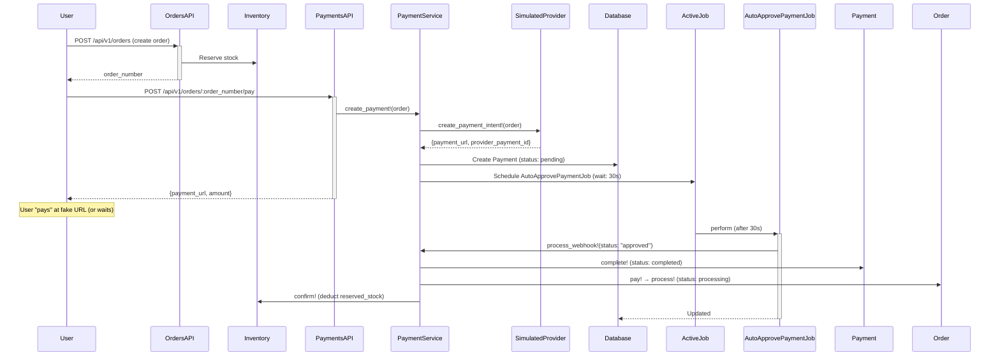
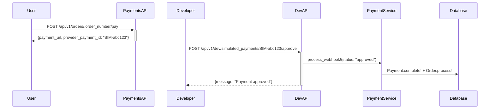

# Payment Simulation Feature

This document describes the **payment simulation architecture** implemented for development and testing.

---

## Overview

The payment system uses a **Strategy pattern** with pluggable payment providers. The default provider is **SimulatedProvider**, which allows testing payment flows without external payment gateways (MercadoPago, Stripe, etc.).

### Goals

✅ **Test payment flows** without external dependencies
✅ **Drop-in replacement** for real providers (change one ENV var)
✅ **Manual and auto-approval** modes for flexibility
✅ **Production-ready architecture** (Strategy pattern)

---

## Architecture

```
┌──────────────────────────────────────────────────────────────┐
│                      PaymentService                          │
│  (Provider-agnostic facade - delegates to active provider)  │
└─────────────────────────┬────────────────────────────────────┘
                          │
                          │ Delegates via Strategy pattern
                          │
          ┌───────────────┼────────────────┐
          │               │                │
┌─────────▼──────┐ ┌──────▼──────┐ ┌──────▼─────────┐
│  Simulated     │ │  MercadoPago│ │    Stripe      │
│  Provider      │ │  Provider   │ │    Provider    │
│  (default)     │ │  (future)   │ │    (future)    │
└────────────────┘ └─────────────┘ └────────────────┘
```

**Key Components:**

1. **PaymentService** — Provider-agnostic facade
2. **BaseProvider** — Interface defining provider contract
3. **SimulatedProvider** — Default implementation (no external calls)
4. **MercadopagoProvider** (future) — Real payment gateway integration

---

## SimulatedProvider Features

### 1. Fake Payment URLs

Returns a simulated payment URL instead of redirecting to external gateway:

```
https://payments.craftitapp.local/pay/SIM-abc123def456?order=CRA-20260322-0001
```

**Pattern:**
- Provider ID: `SIM-<random_hex>`
- URL includes order number for reference
- No actual redirect happens (frontend can mock payment UI)

### 2. Auto-Approval Mode

After creating a payment, an `AutoApprovePaymentJob` is scheduled to automatically approve the payment after a configurable delay.

**Configuration:**
```bash
SIMULATED_PAYMENT_AUTO_APPROVE_DELAY=30  # seconds (default: 30)
```

**Flow:**
1. User initiates payment: `POST /api/v1/orders/:order_number/pay`
2. Payment created with `status: pending`
3. `AutoApprovePaymentJob` scheduled for 30 seconds later
4. Job runs → calls `PaymentService.process_webhook!` with `status: "approved"`
5. Payment transitions to `completed`, order to `processing`

**Use case:** End-to-end testing of payment approval flow without manual intervention.

### 3. Manual Approval Mode (Dev-Only)

For faster iteration during development, use manual approval endpoints:

**Approve:**
```bash
POST /api/v1/dev/simulated_payments/SIM-abc123def456/approve
```

**Reject:**
```bash
POST /api/v1/dev/simulated_payments/SIM-abc123def456/reject
```

**Safeguards:**
- Only available in `development` and `test` environments
- Returns 403 Forbidden in production

**Use case:** Immediate payment approval during development (no 30-second wait).

### 4. No Signature Verification

Simulated provider's `verify_webhook_signature` method always returns `true` (no real signature to verify).

---

## Payment Flow (Simulated)

### Happy Path: Auto-Approval



### Manual Approval (Dev)



---

## Configuration

### Environment Variables

```bash
# Select payment provider (default: simulated)
PAYMENT_PROVIDER=simulated

# Auto-approval delay for simulated payments (seconds)
SIMULATED_PAYMENT_AUTO_APPROVE_DELAY=30
```

### Changing Providers

To switch to a real provider (when implemented):

```bash
PAYMENT_PROVIDER=mercadopago
MERCADOPAGO_ACCESS_TOKEN=your_access_token
MERCADOPAGO_WEBHOOK_SECRET=your_webhook_secret
```

**No code changes needed!** The Strategy pattern allows drop-in replacement.

---

## Migration to Real Providers

### Step 1: Implement Provider Adapter

Create `app/services/payment_providers/mercadopago_provider.rb`:

```ruby
module PaymentProviders
  class MercadopagoProvider < BaseProvider
    def create_payment_intent!(order)
      sdk = MercadoPago::SDK.new(ENV['MERCADOPAGO_ACCESS_TOKEN'])

      preference = sdk.preference.create({
        items: order.order_items.map { |item|
          {
            title: item.product_name,
            quantity: item.quantity,
            unit_price: item.price
          }
        },
        external_reference: order.order_number,
        notification_url: "#{ENV['RAILS_API_URL']}/api/v1/webhooks/payment"
      })

      {
        payment_url: preference.init_point,
        provider_payment_id: preference.id
      }
    end

    def verify_webhook_signature(payload, signature)
      expected = OpenSSL::HMAC.hexdigest(
        OpenSSL::Digest.new('sha256'),
        ENV['MERCADOPAGO_WEBHOOK_SECRET'],
        payload
      )
      ActiveSupport::SecurityUtils.secure_compare(expected, signature)
    end
  end
end
```

### Step 2: Update Environment

```bash
PAYMENT_PROVIDER=mercadopago
MERCADOPAGO_ACCESS_TOKEN=APP_USR-...
MERCADOPAGO_WEBHOOK_SECRET=...
```

### Step 3: Enable Signature Verification

Uncomment webhook verification in `app/controllers/api/v1/webhooks_controller.rb`:

```ruby
def payment
  # Verify webhook signature
  provider = PaymentService.send(:payment_provider)
  unless provider.verify_webhook_signature(request.raw_post, request.headers['X-Signature'])
    return head :unauthorized
  end

  PaymentService.process_webhook!(
    provider_payment_id: params[:provider_payment_id],
    status: params[:status]
  )

  head :ok
end
```

### Step 4: Test & Deploy

No changes to:
- `PaymentService`
- `PaymentsController`
- `OrdersController`
- Database schema
- Frontend API calls

---

## Related Documentation

- [Payment API](../api/v1/payments.md)
- [Webhooks](../api/v1/webhooks.md)
- [Order Flow](order-checkout.md)

---

## Testing

### RSpec Specs

- `spec/services/payment_service_spec.rb`
- `spec/services/payment_providers/simulated_provider_spec.rb`
- `spec/jobs/auto_approve_payment_job_spec.rb`
- `spec/requests/api/v1/payments_spec.rb`
- `spec/requests/api/v1/dev/simulated_payments_spec.rb`

### Manual Testing Checklist

- [ ] Create order with inventory reservation
- [ ] Initiate payment → receives `payment_url`
- [ ] **Option A:** Wait 30 seconds → verify order status changes to `processing`
- [ ] **Option B:** Manual approve → order immediately transitions
- [ ] Verify inventory `reserved_stock` confirmed (decremented)
- [ ] Reject payment → payment status becomes `failed`
- [ ] Verify dev endpoints return 403 in production

---

## Implementation Files

**Services:**
- `app/services/payment_service.rb` — Main facade
- `app/services/payment_providers/base_provider.rb` — Interface
- `app/services/payment_providers/simulated_provider.rb` — Simulated implementation

**Controllers:**
- `app/controllers/api/v1/payments_controller.rb` — Initiate payment
- `app/controllers/api/v1/webhooks_controller.rb` — Webhook processing
- `app/controllers/api/v1/dev/simulated_payments_controller.rb` — Manual approval (dev-only)

**Jobs:**
- `app/jobs/auto_approve_payment_job.rb` — Auto-approval
- `app/jobs/reservation_timeout_job.rb` — Cancel expired orders

**Models:**
- `app/models/payment.rb` — AASM state machine
- `app/models/order.rb` — AASM state machine
